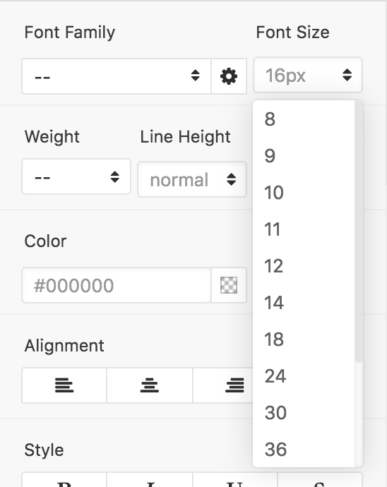
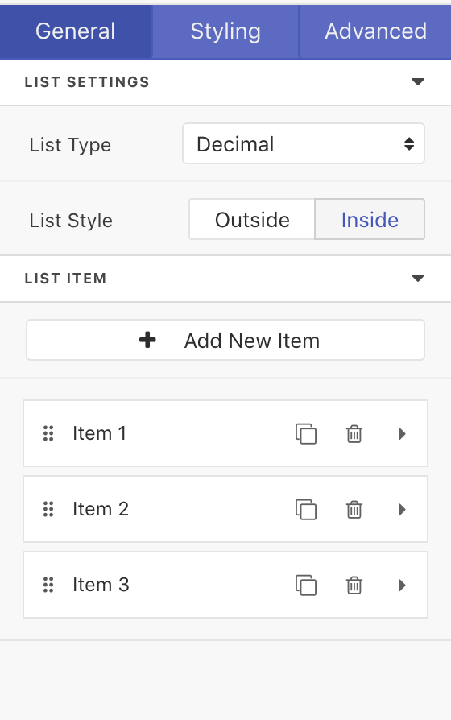
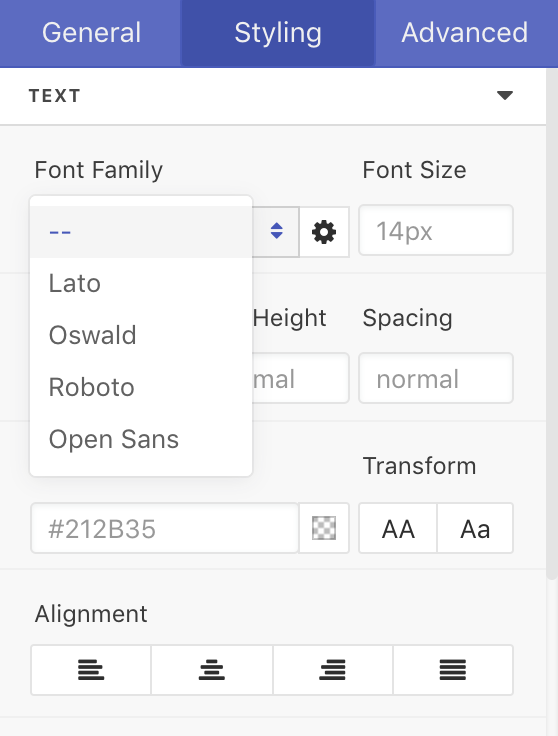
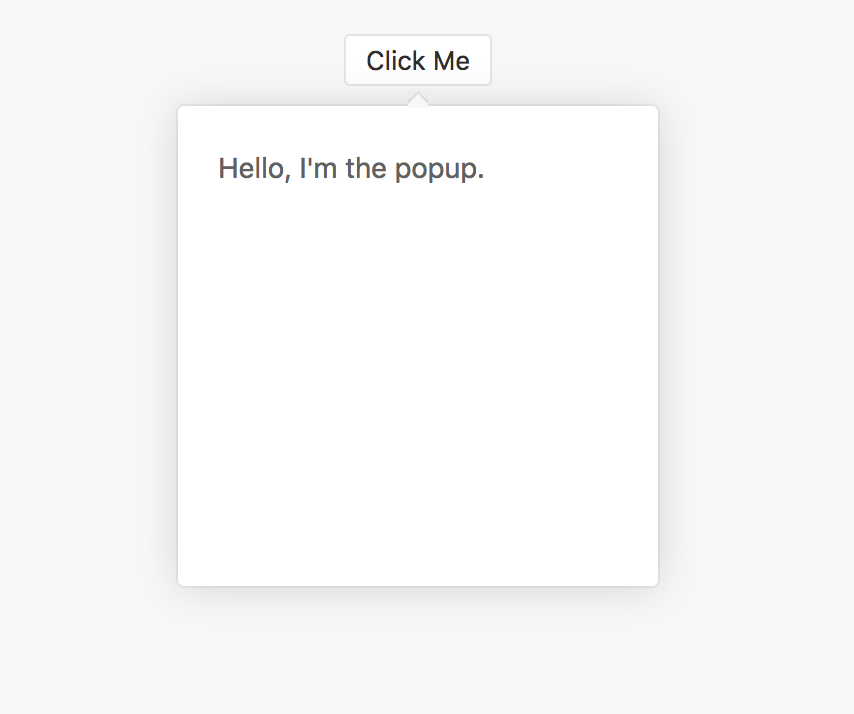
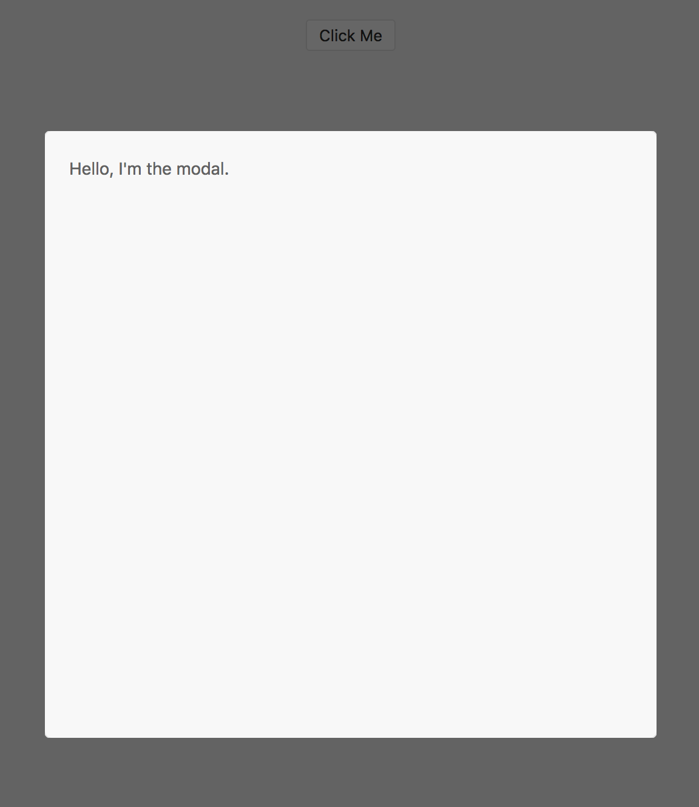
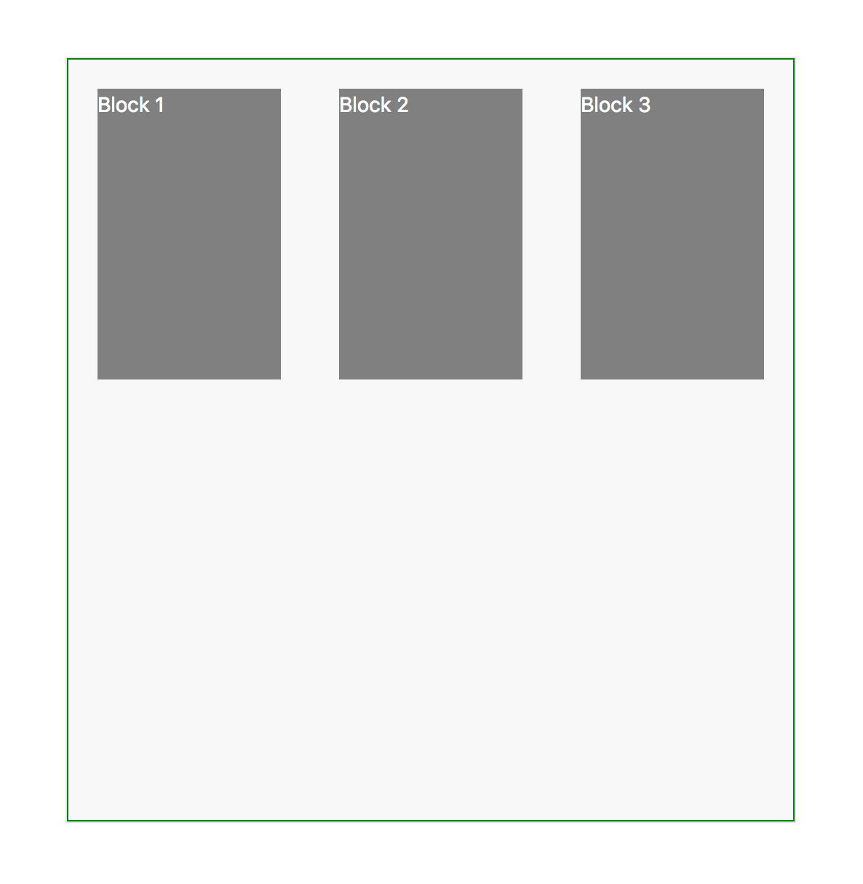

# UI Components References

## UI Controls

> Almost all UI Controls which extend `UIControl` are placed neatly in the Inspector panel, some common UI Controls usage can be found [here](https://www.w3schools.com/Html/html_form_input_types.asp). Also, please mind the type of inputs as it's not the name of the UI Control. You will need to get into the render part of a given UI Control to see which type it belongs to.

**Props explanation**

| Name | Type | Description |
| --- | --- | --- | --- | --- | --- | --- | --- | --- | --- | --- |
| `type` | string | Type of UI Control |
| `bind` | string | Value binding destination |
| `value` | any | Current value of UI Control |
| `target` | any | The instance that stores the value |
| `group` | string | Deprecated |
| `subscribe` | string | Deprecated |
| `parse` | function | Modify value in |
| `format` | function | Modify value out |
| `onChange` | function | Provide user's input value |
| `active` | any | Deprecated |

### UIInput

It's `<input type="text" />` in html, take a look at the input box right below the Font Size label.



  
**Code related**



```jsx
<UIInput
    bind="style.fontSize"
    format={_.addPixel}
    options={[8, 9, 10, 11, 12, 14, 18, 24, 30, 36, 48, 60, 72, 96]}
/>
```



**Props explanation**

| Name | Type | Description |
| --- | --- | --- | --- | --- |
| `type` | string | Type of input to validate user's input value |
| `size` | string | Size of input box |
| `align` | string | Alignment of the text inside the input box |
| `plain` | boolean | Should remove all styles of the input box |


### UIButton

It's `<button />` in html, take a look at the Button "Add New Item" with a little plus on the left side.



  
**Code related**



```jsx
<UIButton icon="plus" label="Add New Item" onClick={this.addItem} />
```



#### Props explanation

| Name | Type | Description |
| --- | --- | --- | --- | --- | --- | --- | --- | --- | --- |
| `order` | number | Flex order |
| `plain` | boolean | Should remove all styles |
| `size` | string | Size of UI Button |
| `disabled` | boolean | Provide disabled style |
| `danger` | boolean | Provide danger style |
| `compact` | boolean | Provide compact style |
| `loading` | boolean | Should has loading |
| `isLoading` | boolean | Should displays loading |
| `loadingTime` | number | The duration of loading |

### UISelect

UI Select is placed underneath the Font Family label in the below picture.



**Code related**



```jsx
<UISelect
	off=""
	bind="style.fontFamily"
	parse={parseFontFamily}
	options={fonts.map(f => {
		if (!f.get('label')) f.set('label', f.get('family'))
		return f
	})}
	mapping={fontOptionsMap}
	emptyOption
	style={{ width: '100%' }}
/>
```



#### Props explanation

| Name | Type | Description |
| --- | --- | --- | --- | --- | --- | --- |
| `type` | string | Type of UI Select |
| `options` | collection \| string \| object \| array | Options of UI Select |
| `multiple` | boolean | Should allow multiple select |
| `searchable` | boolean | Is allowed to search |
| `emptyOption` | boolean | Should provide an empty option |
| `mapping` | object | Defines label, value and icon to map |

### UICheckbox


#### Code related



```jsx
import UIApp from 'components/ui/providers/UIApp'
import UI from 'components'

export default class extends Component {
   render() {
      return (
         <UIApp>
            <Wrapper>
               <h3>Hi there ;)</h3>
               We introduce to you our UI Slider.
               <UI.Checkbox
                  label="The checkbox is on my left, and I am its label"
                  isOn
                  onChange={value => {
                     console.log('new value', value)
                  }}
               />
            </Wrapper>
         </UIApp>
      )
   }
}
const Wrapper = styled.div`
   margin: 20px auto;
   text-align: center;
   line-height: 20px;
`
```



#### Props explanation

| Name | Type | Description |
| --- | --- | --- | --- |
| `isOn` | boolean | Should UI Checkbox be checked by default |
| `label` | string | Label of UI Checkbox |
| `onChange` | function | Triggered after checked state is changed |

### UISlider

### UISwitch

### UITogglable

## UI Widgets

> All UI Widgets use `UIWidget` - A React Component makes its inheritances floated by increasing their zIndex by one based on a global variable `UIWidget.zIndex` so that the latest gets floated always get the highest `zIndex` value.
>
> NOTICE: It's important to have `UIWidget.Portal` rendered somewhere so that all UI Widgets have a place to render

### UIPopup



#### Code related



```jsx
import UIApp from 'components/ui/providers/UIApp'
import UIWidget from 'components/ui/interfaces/UIWidget'
import UI from 'components'

export default class extends Component {
    render() {
        return (
            <UIApp>
                <UI.Layout>
                    <UIWidget.Portal />
                    <UI.Popup trigger={<UI.Button label="Click me" style={{ margin: '20px auto' }} />} event="focus">
                        <Content>Hello, I'm the popup.</Content>
                    </UI.Popup>
                </UI.Layout>
            </UIApp>
        )
    }
}

const Content = styled.div`
    width: 200px;
    height: 200px;
    margin: 20px;
`
```



#### Props explanation

| Name | Type | Description |
| --- | --- | --- | --- | --- |
| `trigger` | object | A view to open UI Popup  |
| `event` | string | Which event should UI Popup opens |
| `arrow` | boolean | Should UI Popup has arrow |
| `defaultsPos` | string | Default position for UI Popup |

### UIModal



#### Code related



```jsx
import UIApp from 'components/ui/providers/UIApp'
import UIWidget from 'components/ui/interfaces/UIWidget'
import UI from 'components'

export default class extends Component {
   state = {
      open: false
   }
   render() {
      return (
         <UIApp>
            <UI.Layout width={300} >
               <UIWidget.Portal />
               <UI.Button
                  label="Click me"
                  onClick={() => {
                     this.setState({ open: true })
                  }}
                  style={{ margin: '20px auto' }}
               />
               <UI.Modal
                  open={this.state.open}
                  onClickOutside={() => {
                     this.setState({ open: false })
                  }}
                  width={400}
                  height={500}
               >
                  <UI.Layout>
                     <Content>Hello, I'm the modal.</Content>
                  </UI.Layout>
               </UI.Modal>
            </UI.Layout>
         </UIApp>
      )
   }
}

const Content = styled.div`
   width: 200px;
   height: 200px;
   margin: 20px;
`
```



#### Props explanation

| Name | Type | Description |
| --- | --- | --- | --- | --- | --- | --- | --- | --- | --- | --- | --- | --- |
| `open` | boolean | Should UI Modal open |
| `onClickOutside` | function | Triggered after Modal overlay area is clicked |
| `header` | object | UI Modal header view |
| `footer` | object | UI Modal footer view |
| `onClose` | function | Triggered after close icon on the header is clicked |
| `style` | object | Custom styles for UI Modal |
| `dimmer` | boolean | Should UI Modal overlay is dimmed |
| `closeIcon` | boolean | Should UI Modal has close icon |
| `fullScreen` | boolean | Should UI Modal is full screen |
| `primary` | boolean | Should UI Modal header has primary style |
| `styleHeader` | object | Custom styles for header |
| `styleFooter` | object | Custom styles for footer |

## UI Layouts

### UILayout

> `UILayout` has several static variables inside, they all have the same props which function merely the same with UILayout. For example: `UILayout.Nav`, `UILayout.Sidebar`, `UILayout.Header`,...
>
> We make an example at [here](https://developer.pagefly.io/core/components-usage-guidelines/designing-views-using-ui-layouts).



#### Code related



```jsx
import UIApp from 'components/ui/providers/UIApp'
import UI from 'components'

export default class extends Component {
   render() {
      return (
         <UIApp>
            <UI.Layout style={{ border: '1px solid green', width: '500px', margin: '100px auto' }}>
               <Content>Block 1</Content>
               <Content>Block 2</Content>
               <Content>Block 3</Content>
            </UI.Layout>
         </UIApp>
      )
   }
}

const Content = styled.div`
   width: 200px;
   height: 200px;
   margin: 20px;
   background: grey;
   color: white;
`
```



#### Props explanation

| Name | Type | Description |
| --- | --- | --- | --- | --- |
| `vertical` | boolean | Should UI Layout is ordered vertically |
| `reverse` | boolean | Should UI Layout content is reversed |
| `flex` | string | Flex value for UI Layout |
| `style` | object | Custom styles for UI Layout |



