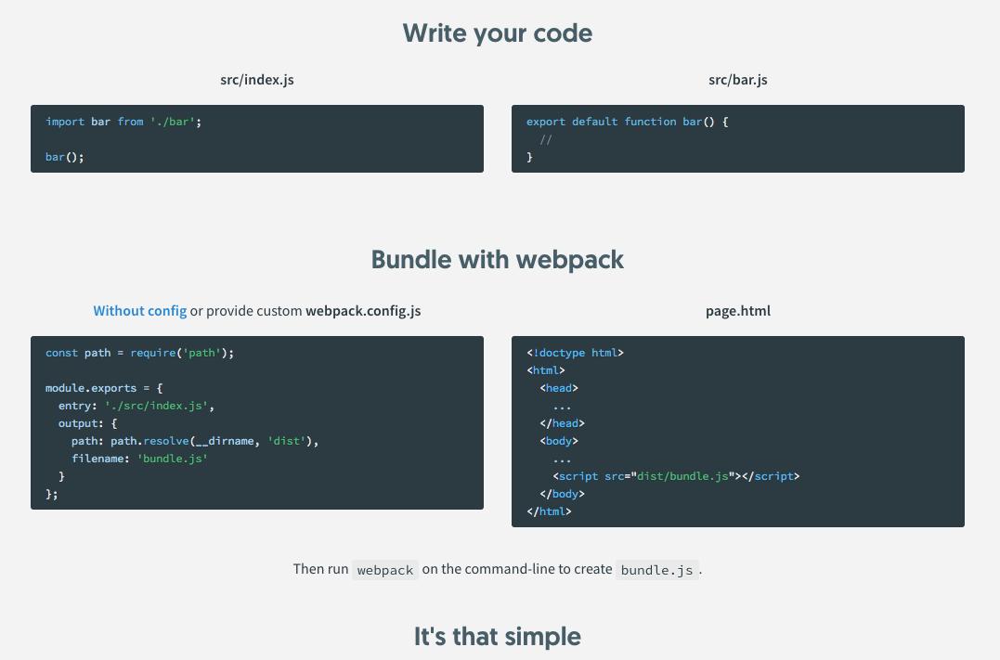

# App Initialization flow

### Webpack



Our project is using Webpack as the build tool, basically, the concept is just written JS/CSS/HTML..., and Webpack will bundle it all to the bundle folder that you can load from backend.


### Entry.js

Our app will start from the file `entry.js`, where you can prepare the data, configuration before starting app, also, if there too much things to configs, you can do it in the `setup.js` file.

### Which data do you need to run PageFly editor app?

```javascript
import page from 'stores/page'
page.set({
   items: [
      { _id: 0, type: 'Head', children: [] },
      { _id: 1, type: 'Body', children: [2] },
      { _id: 2, type: 'Layout', children: [] }
   ]
})
```


### Page Container

This is where you define functionality to handle the communicating part between backend and editor app, simply add your function/needed state in to `pageContainer.js` file and follow [`unstated`](https://github.com/jamiebuilds/unstated) implementation.

